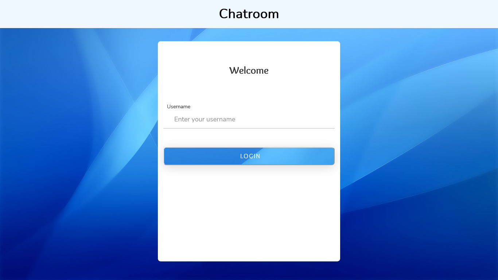
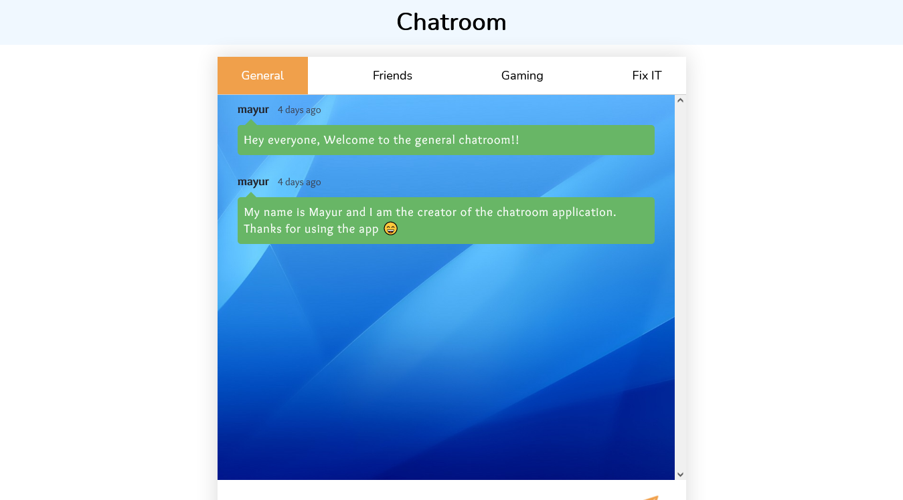

# mini Chatroom web application

### Introduction
A simple, interactive, responsive, real-time based mini chatroom web application where users can easily communicate with each other in the specified chatrooms.

The [firebase firestore](https://firebase.google.com/) - a flexible, scalable cloud database developed by Google, is used for storing the details of the user and messages.

The [dateFNS](https://date-fns.org/) - a modern JS date utility library is used to filter the date format.

### Instructions
Login or register with your username and you will enter the chatroom application. At the time of creation, I have provided four chatroom: general, friends, gaming and fixIT. You can chat with any online user. 

### ScreenShots

<strong> &copy; 2021 by mayur</strong>